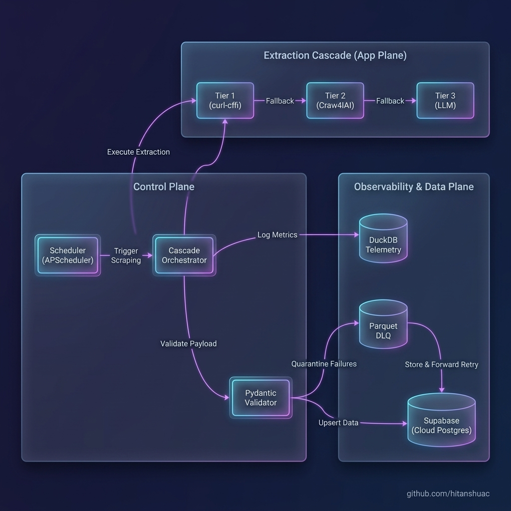

# ConceptKart ETL Pipeline 🛒📊



A production-grade, Agentic ETL (Extract, Transform, Load) pipeline designed to dynamically track, analyze, and alert on e-commerce pricing data. This project demonstrates high-availability architecture, strict SRE data governance, and autonomous self-healing capabilities.

---

## 🏛️ Architecture: The Split-Plane Environment

This repository is built as an **Antigravity Base Agentic Environment**, featuring a strict separation between the AI Control Plane and the Application Plane.

### 1. The Cloud Data Plane (Supabase & React)
- **Supabase (PostgreSQL)**: Serves as the central cloud database for `tracked_products` and `raw_daily_prices`.
- **React Dashboard**: A separate frontend UI (located in `/dashboard`) that provides a user-friendly interface to view historical price charts and manage tracking targets.

### 2. The Extraction Cascade (Python Agent)
The backend pipeline operates a **3-Tier Fallback Cascade** to guarantee 99%+ scraping success rates without getting blocked:
- **Tier 1 (curl-cffi)**: High-speed TLS HTTP impersonation using Open Graph and JSON-LD parsing.
- **Tier 2 (Crawl4AI + Playwright)**: Stealth browser rendering for JavaScript-heavy single-page applications.
- **Tier 3 (LLM Self-Healing)**: AI-driven extraction (via Groq/OpenRouter/HuggingFace) that automatically bypasses layout redesigns and structural changes.

### 3. SRE & Observability Plane
- **Pydantic Validation & DLQ**: Strict data contracts ensure corrupt data never enters Supabase. Validation failures trigger a Store-and-Forward mechanism, saving payloads to a local Parquet Dead-Letter Queue for automatic retry.
- **DuckDB Telemetry**: A local `.db` file powered by DuckDB captures deep analytics on pipeline performance, latency, and extraction success rates without blocking the main event loop.
- **AST-Compressed Error Logs**: All exceptions are parsed by `jCodeMunch` and logged as structured JSON to maintain a highly compressed context window for autonomous debugging.

---

## 🚀 Key Features
- **Idempotent Data Ingestion**: Uses `UPSERT` conflict resolution to prevent duplicate records during network retries.
- **Zero Data Loss Guarantee**: A Store-and-Forward retry loop checks for failed cloud uploads on every startup.
- **Anti-Bot Evasion**: Randomized residential User-Agents, TLS fingerprinting, and per-domain rate limiting.
- **Multi-Channel Alerts**: Built-in alerting to trigger instant **Telegram Bot** and **Webhook** notifications when target prices are hit.

---

## 🛠️ Technical Stack
- **Languages**: Python 3.11+ / JavaScript (React)
- **Cloud Database**: Supabase (Postgres)
- **Local Analytics**: DuckDB & PyArrow (Parquet)
- **Extraction**: `curl-cffi`, `Crawl4AI`, `BeautifulSoup4`
- **Orchestration**: `APScheduler`
- **AI Models**: Llama-3-8B (via Groq/OpenRouter/HF)

---

## ⚙️ Configuration & Setup

Set the following environment variables in your local `dashboard/.env` file. (The Python backend automatically sources credentials from the dashboard's environment to ensure parity).

```env
# Cloud Database (Required)
VITE_SUPABASE_URL=https://your-project.supabase.co
VITE_SUPABASE_ANON_KEY=your_anon_key

# LLM Fallback Provider (Pick one - Required for Tier 3)
GROQ_API_KEY=gsk_...
# OPENROUTER_API_KEY=sk-or-...
# HF_API_KEY=hf_...

# Notifications (Optional)
TELEGRAM_BOT_TOKEN=...
TELEGRAM_CHAT_ID=...
WEBHOOK_URL=https://hooks.slack.com/...
```

---

## 🧪 Local Development & Testing Guide

To test the system end-to-end, follow these steps:

### 1. Start the React Dashboard
The dashboard allows you to visualize the data in real-time.
```bash
# Navigate to the dashboard directory
cd dashboard

# Install dependencies
npm install

# Start the Vite development server
npm run dev
```
Open your browser to `http://localhost:5173`. You should see the UI. If no data exists, it will prompt you to run the initial scrape.

### 2. Add a Tracking Target
You can add a product to track either through the Dashboard UI, or via the Python CLI. Open a new terminal window at the root of the project:
```bash
# Add a product to track (Target price: Rs. 17000)
python manage_targets.py add "https://conceptkart.com/products/shanling-eh1-desktop-dac-and-headphone-amplifier" 17000

# Verify it was added to the Supabase tracking queue
python manage_targets.py list
```

### 3. Run the Backend Extraction Pipeline
Manually trigger the scraper to extract data, validate it, and push it to Supabase.
```bash
python main.py
```
*Watch the terminal logs. You will see the 3-Tier Cascade execute. If the price matches the target, it will trigger the Notifier.*

### 4. Verify in the Dashboard
Once `main.py` finishes:
1. Go back to your browser `http://localhost:5173`.
2. Refresh the page. You should now see the product listed, its current price, and the historical trend chart populated with the newly scraped data point!

### 5. Running Continuously (Production)
To run the scraper continuously in the background (default: every 6 hours):
```bash
python daemon.py
```

---
**Focus: Data Engineering, AI Self-Healing, and Scalable Agentic Architecture.** 🛡️✨
